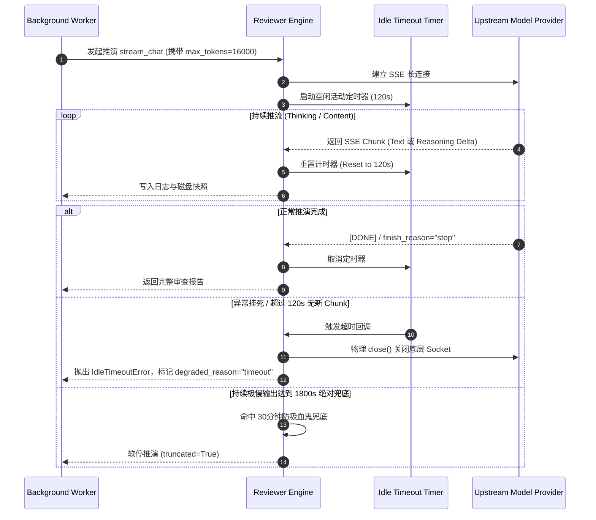

# Reviewer 极简轻量化守卫架构设计方案 (Minimalist MVP Guard Architecture)

> **文档标识**: `docs/roadmap/plan_reviewer_lightweight_timeout_and_cost_mvp.md`  
> **状态**: 📋 待实施架构蓝图 (Architecture Blueprint)  
> **提出时间**: 2026-10-10  
> **核心主题**: 裁剪过度防御冗余，建立以“空闲静默超时 + 请求级 max_tokens + 有界重试”为核心的 3 正交硬原语极简底线，并加固跨平台 Hook 包装器隔离  
> **裁决裁定**: Reviewer 深度架构评审与红队评估裁决批准（已裁定采纳极简 MVP 路线）  
> **设计哲学**: **“削减冗余的广度（砍掉复杂的层级、软预算与自适应启发式），绝不削减兜底的深度（保留物理硬约束）。”**

---

## 1. 评审裁决与定性评估 (Reviewer Adjudication & Qualitative Assessment)

### 1.1 评审裁决核心结论
在 Reviewer 的深度架构评审与红队评估下，对轻量化方案给出了明确且坚定的裁决：
- **核心结论**：**这是一个极好的建议。**
- **工程语境**：对于本仓库（单开发者使用的轻量 CLI / MCP 工具），过度设计的 7 层防御栈不仅收益递减，还会带来调试地狱与层间交互死锁；**极简 MVP 完全足以兜底，前提是保留下来的少数几个守卫必须具备“物理真实性”**。
- **架构黄金法则**：
  > **“削减冗余的广度（砍掉复杂的层级、软预算与自适应启发式），绝不削减兜底的深度（保留少量正交的物理硬底线）。”**

### 1.2 定性对比评估：为什么轻量化是正确选择？

| 维度 | 方案 A：7 层企业级防御栈（L0~L7 + TimeBudget 等） | 方案 B：极简 MVP（3 个正交硬原语） |
|---|---|---|
| **心智负担** | 极高：需推理层间优先级与覆盖顺序 | **极低**：只有 3 个互不干扰的独立概念 |
| **测试成本** | 组合爆炸，需编写大量复杂的层间交互测试 | **极低**：3 个不变量，各自单测可穷举 |
| **防御效果** | 边际递减（第 5~7 层收益几乎为 0） | **完备**：前 3 层吃下 >99.9% 的真实风险 |
| **适用场景** | 多租户、高并发计费的公共 SaaS 平台 | **单开发者本地工作区、轻量 CLI / MCP 工具** |

**定性裁定**：在当前工具的语境下，过度防御是“假想敌防御”。把 3 个物理失效（挂死、无限放大、进程死亡）用 7 层软逻辑去猜，反而容易引发误杀或自锁。**走向极简 MVP 是完全正确且必要的。**

### 1.3 历史演进背景
在 Task 4.1 引入 `dev_reviewer_submit` / `dev_reviewer_poll` 异步长作业体系之前，Reviewer 调用依赖同一轮次同步阻塞工具（如 `dev_reviewer_consult`）。为了防止宿主 IDE MCP 客户端发生传输层硬超时（Transport Timeout，通常约 180s），系统设置了基于绝对自然时钟（Wall-clock）的机械硬上限（默认 60s、强制硬钳位 600s）。

全面转向异步长作业架构后：
1. **传输超时已非瓶颈**：MCP 交互改由毫秒级返回句柄的 `submit` 与短轮询（`wait_max_s <= 25s`）的 `poll` 组成，宿主 IDE 的传输超时物理约束已彻底解除。
2. **长思考推理模型遭误杀**：现代深度推理模型（如 DeepSeek-R1、Claude 3.7 Thinking）在面对复杂架构审计时，产生 10k~30k tokens 的思考过程耗时数分钟极为常见。当前只要绝对时间到达 `timeout_seconds`，`asyncio.wait_for` 便会在模型稳定推流时机械掐断，造成严重的算力与时间浪费。

---

## 2. 致命事故底线：最少必要集合 (Fatal Invariants & Minimal Sufficient Set)

### 2.1 四维失效与极简防线映射
系统的灾难性失效空间本质上只有**三维**物理失效 + **一维**既有进程外逃逸，因此只需 **3 个正交的硬防线 + 1 个既有进程外兜底** 即可实现 100% 封闭，无需更多嵌套：

| 失效类型 | 致命后果 | 极简防线（原语） | 极简实现方式 |
|---|---|---|---|
| **1. 进程内挂死** | Socket 永久阻塞、独占租约导致全局串行死锁 | **空闲超时（Idle Timeout）** | 每收到一个 chunk 就重置计时，若持续静默超过 **120s**，立即调用 `AbortHandle` **物理关闭 socket**（必须真 close，绝不能只改一个 flag）。 |
| **2. 进程内放大** | 慢速死循环输出导致 Token 账单打爆 | **请求级 `max_tokens`** | 直接交给模型 Provider 的参数（如 `16000` 或 `32000`），一个整数在底层锁死输出规模。 |
| **3. 接口被击穿** | 异常时无脑重试打爆 API / 触发 429 封号 | **有界重试** | 固定 `max_attempts = 3` + 指数退避，遇 `400/401/403` 等客户端错误立即放弃。 |
| **4. 进程级死亡** *(既有)* | 进程崩溃或强杀，残余锁导致任务永久不可用 | **租约 TTL + Generation CAS** | 现有的 [workspace_lease.py](file:///d:/Work/Quench/quorch/plugins/quench-dev-tasks/server/workspace_lease.py) 机制，独立于工作进程外自动回收，**保持现状不动**。 |

### 2.2 架构防护矩阵
```
+------------------------------------------------------------------------+
|  Guard 1 — 时间维度：空闲活动截止线 (Idle / Activity Timeout)           |
|    持续无 chunk 输出超过 T_idle (120s) -> 物理调用 AbortHandle 关 Socket   |
|    (每收到任意 text / reasoning delta 重置计时；宽容慢调用，严惩真挂死)   |
+------------------------------------------------------------------------+
|  Guard 2 — 用量维度：请求级 max_tokens 上限                           |
|    单一整数交由 Provider API 原生截断 (成本物理锁死，杜绝吸血鬼)         |
+------------------------------------------------------------------------+
|  Guard 3 — 频次维度：有界指数退避重试                                  |
|    max_attempts = 3，退避 1s -> 2s，遇到 4xx 客户端错误立即放弃          |
+------------------------------------------------------------------------+
|  Backstop — 进程外底线：租约 TTL + Generation CAS                      |
|    由 workspace_lease.py / manifest_lease.py 独立于进程外兜底 (保持不动)|
+------------------------------------------------------------------------+
```

### 2.3 数学完备性证明
设单次调用：
- 空闲超时阈值为 $T_{	ext{idle}}$
- 模型输出速率为 $r$
- 请求级输出上限为 $	ext{max\_tokens}$
- 网络最大尝试次数为 $	ext{max\_attempts}$

单次调用的总资源消耗上限：
$$	ext{Cost}_{	ext{max}} \le 	ext{max\_attempts} 	imes \max\left(T_{	ext{idle}},\, rac{	ext{max\_tokens}}{r}
ight)$$

在数学上**严格有界**。
- 要么因持续静默挂起被 120s 空闲超时物理熔断；
- 要么在稳定输出下达到 $	ext{max\_tokens}$ 由 Provider 底层原生截断；
- 遇到网络抖动最多尝试 3 次，且遇 4xx 立即快速失败；
- 发生宿主断电、SIGKILL 或进程崩溃时，由独立进程外的租约 TTL 与 Generation CAS 自动回收。

**结论**：这 3 个维度已经完全覆盖了所有不可接受的致命风险，任何第 4、第 5 个运行时守卫都属于非必要的冗余。

---

## 3. 过度工程裁剪清单 (Pruning List)

### 3.1 🟢 可以直接剔除 / 大幅合并的冗余包袱（后果完全可容忍）
1. **自适应多跳门控**（`should_enable_multi_hop()`、遥测采样门槛 20 次等）：
   - 属于复杂的统计启发式，日常开发几乎无法积累 20 个样本，是典型的“永远无法激活的假防御”。
   - 多跳与单跳无非是多耗费几次推演，后果完全可容忍，直接简化或交由配置决定。
2. **多层推理软预算**（`MAX_REASONING_TOKENS_CEILING = 32000` 与 `HopBudget` 重叠）：
   - 与请求级 `max_tokens` 功能重复，形成双重 SSOT。
   - 直接合并为单一硬上限或由 Provider 参数统一在底层兜底。
3. **600s 家长式强制钳位**：
   - 属于早期的家长式配置限制。
   - 将其放开，改为一个极度宽松的防死循环安全上限（如 `1800s` 或 `3600s`），日常由 **120s 空闲静默超时** 负责斩杀真正的挂死。
4. **切片行数的多层参数**（`MIN_WINDOW_LINES` / `DEFAULT_WINDOW_LINES` / `MAX_WINDOW_LINES`）：
   - 坍缩为一个单一的默认窗口行数（如 200 行）。
   - 给多给少最多影响上下文大小，后果完全可容忍。
5. **多层日志配额与复杂告警**：
   - 日志保留简化为“保留最近 N 个”即可，无须保留统一配额、pin、retention 三套并存机制。

### 3.2 🔴 必须保留的硬核边界（不可妥协）
- **`AbortHandle` 物理关闭 Socket**：
  如果超时只置布尔值不关底层网络连接，线程依旧阻塞，就是“安全剧场”。必须调用 `http_response.close()` / `connection.abort()` 物理关闭 socket。
- **进程外租约 TTL / CAS**：
  保证进程被 kill 之后工作区不会死锁（[workspace_lease.py](file:///d:/Work/Quench/quorch/plugins/quench-dev-tasks/server/workspace_lease.py) 与 [manifest_lease.py](file:///d:/Work/Quench/quorch/plugins/quench-dev-tasks/server/manifest_lease.py)）。

### 3.3 裁剪明细对照表

| 裁剪模块 | 涉及代码位置 | 处理动作 | 裁剪理由与影响分析 |
|---|---|:---:|---|
| **自适应多跳门控** | [consultation.py](file:///d:/Work/Quench/quorch/plugins/quench-dev-tasks/server/consultation.py) 中的 `should_enable_multi_hop()`、`MULTI_HOP_DEMAND_THRESHOLD = 0.30`、`MIN_TELEMETRY_SAMPLES = 20` | **🟢 整块移除** | 复杂统计启发式，日常开发几乎无法激活。多跳与单跳后果可容忍，直接由配置控制。 |
| **跨跳累积软预算** | [consultation.py](file:///d:/Work/Quench/quorch/plugins/quench-dev-tasks/server/consultation.py) 中的 `HopBudget` 及其分层扣减逻辑 | **🟢 合并收敛** | 简化为单实例单上限，消灭分层消耗与原子扣减的嵌套复杂度。 |
| **推理链双重软天花板** | [consultation.py](file:///d:/Work/Quench/quorch/plugins/quench-dev-tasks/server/consultation.py) 中的 `MAX_REASONING_TOKENS_CEILING = 32000` | **🟢 并入 max_tokens** | 与请求级 `max_tokens` 属于功能重复的双重 SSOT。由 Provider 的 `max_tokens` 参数底层拦截。 |
| **600s 家长式强制钳位** | [project_config.py](file:///d:/Work/Quench/quorch/plugins/quench-dev-tasks/server/project_config.py) 中的 `_coerce_positive_int(..., hi=600)` | **🟢 放宽至 1800s 兜底** | 放宽绝对天花板，由 120s 空闲静默超时负责斩杀真正的挂死，避免误杀深思模型。 |
| **切片行数多层参数** | `MAX_LINES_PER_SLICE` / `MIN_WINDOW_LINES` / `DEFAULT_WINDOW_LINES` | **🟢 坍缩为单一默认值** | 仅影响上下文整形，后果完全可容忍。单一 200 行默认值足以覆盖。 |
| **日志多层配额管理** | `MAX_LOG_FILES_QUOTA`、统一配额、pin、retention 三套并存 | **🟢 简化为保留最近 N 个** | 本地日志磁盘占用可容忍，简化为极简滚动清理。 |
| **`AbortHandle` 物理关闭** | [consultation.py](file:///d:/Work/Quench/quorch/plugins/quench-dev-tasks/server/consultation.py) 中的 `AbortHandle._do_abort()` 物理关闭底层 Socket | **🔴 坚决保留** | 核心物理防线。若只修改标志位，底层连接依然挂死，必须执行物理 Socket 关闭。 |
| **进程外租约 TTL / CAS** | [workspace_lease.py](file:///d:/Work/Quench/quorch/plugins/quench-dev-tasks/server/workspace_lease.py) 中的租约心跳与 Generation CAS | **🔴 坚决保留** | 唯一覆盖进程崩溃与强杀的独立物理兜底，必须保持现状不动。 |

---

## 4. 推荐的落地实践方案 (Target Implementation Design)

### 4.1 核心顶级常量模型（4 个清晰透明常量）
代码层面仅需收敛为 4 个清晰透明的顶级常量，零分层嵌套：

```python
# plugins/quench-dev-tasks/server/reviewer_engine.py

# 1. 主防线：持续 120 秒无任何 chunk (text 或 reasoning) 输出立即物理 abort
REVIEWER_IDLE_TIMEOUT_S: Final[float] = 120.0

# 2. 宽松大兜底：防持续极慢的极端吸血鬼 (30分钟绝对硬兜底，非激进截断)
REVIEWER_ABSOLUTE_CEILING_S: Final[float] = 1800.0

# 3. 成本防线：交由 Provider 底层强制截断
REVIEWER_MAX_TOKENS: Final[int] = 16000

# 4. 频次防线：指数退避，4xx 客户端错误不重试
REVIEWER_MAX_ATTEMPTS: Final[int] = 3
REVIEWER_BACKOFF_BASE_S: Final[float] = 1.0
```

### 4.2 推演执行流架构时序图



---

## 5. 跨平台 Hook 鲁棒性与 `.cmd` 包装器隔离设计 (Windows Hook Resilience & .cmd Wrapper Architecture)

### 5.1 事故溯源与底层机理
在 Antigravity 体系中，宿主客户端存在双引擎演进：
1. **Antigravity IDE**：基于 VS Code 扩展（Node.js），底层 `child_process.exec` 在 Windows 下以 Verbatim 模式运行，不破坏参数内部双引号。
2. **Antigravity 独立客户端 (2.x)**：基于 Go 语言编译的原生 `language_server.exe`。Go 标准库 `os/exec` 在调用 `cmd.exe /c <command>` 时，强制遵循 `CommandLineToArgvW` 规范，**自动将字符串内的所有双引号转义为 `\"`**。

而古老的 `cmd.exe` 不认 `\"` 为转义符，导致解析出带反斜杠的非法可执行文件名（如 `'"D:\..."' 不是内部或外部命令`），造成 PreToolUse Hook 崩溃，并引发宿主 IDE 状态机脱节死锁。

### 5.2 为什么 8.3 短路径不可作为工业方案
Windows 原生 8.3 短路径（`GetShortPathNameW`，如 `C:\PROGRA~1`）在现代系统中有严重隐患：
- **Dev Drive / ReFS 文件系统**：Windows 11 专为开发设计的 Dev Drive 完全不支持 8.3 命名。
- **组策略禁用**：现代非系统盘或企业安全基线常默认禁用 8.3 别名，此时 API 退化返回带空格长路径。
- **编号漂移与碰撞**：同名目录下 `~1` 与 `~2` 编号存在重命名漂移风险。

### 5.3 `.cmd` 包装器核心原理：转义域物理隔离 (Escaping Scope Isolation)
成熟工业工具（如 `npm.cmd`、`pip.exe`、`cargo`）的标准解法为：**跳板批处理包装器 (`.cmd`)**。
- **外层无引号暴露**：`hooks.json` 仅注册裸脚本路径（`plugins/quench-dev-tasks/server/hooks/file_guard_runner.cmd`），绝不带参数与引号，Go 运行时绝不产生 `\"` 转义；
- **内层原生双引号解析**：带空格的路径、虚拟环境 Python 解释器在 `.cmd` 内部由 `cmd.exe` 原生语法解析，完全免疫跨运行时转义冲突。

### 5.4 四大约束与防范规约
| 潜在副作用 | 危害表现 | 强制防范规约 |
|---|---|---|
| **退出码丢失** | Python 拦截信号被后续命令覆盖为 0 | 脚本末尾强制使用 `exit /b %ERRORLEVEL%` 透传真实状态 |
| **管道死锁** | 回显污染破坏 JSON 解析 | 脚本首行强制 `@echo off`，杜绝任何非协议输出 |
| **文件锁独占** | 运行时被重写导致 WinError 32 | 包装器固化为静态发布资产，运行时严禁动态覆写 |
| **代码页乱码** | 中文路径在 ANSI 下乱码 | 包装器必须保存为纯 ASCII / 无 BOM UTF-8，优先使用相对路径变量 `%~dp0` |

---

## 6. 实施路线图与验收验证 (Implementation Roadmap & Verification)

### 阶段一：清理与裁剪冗余包袱（Slimming & Deadweight Pruning）
1. 移除 [consultation.py](file:///d:/Work/Quench/quorch/plugins/quench-dev-tasks/server/consultation.py) 中的 `should_enable_multi_hop()`、遥测采样门槛 20 次等启发式死代码；多跳改为由配置与指令驱动。
2. 简化 `HopBudget`，统一合并上下文注入字符预算。
3. 移除 `MAX_REASONING_TOKENS_CEILING`，将用量防线完全交由请求参数 `max_tokens`。
4. 简化切片窗口参数与多层日志配额。

### 阶段二：落地正交三原语（Landing 3 Orthogonal Hard Primitives）
1. **落地 120s 空闲静默超时**：
   在 SSE/流式读取循环中实现轻量级活动时间记录器。每收到任意 `delta.content` 或 `delta.reasoning` 即刷新活动时间戳；若空闲超过 120s，立即调用 `AbortHandle` **物理关闭底层 Socket**。
2. **解除 600s 家长式强制钳位**：
   将 [project_config.py](file:///d:/Work/Quench/quorch/plugins/quench-dev-tasks/server/project_config.py) 中 `timeout_seconds` 的硬钳位上限由 `600` 放宽至 `1800`，解除对深思模型的误杀。
3. **收敛请求级 `max_tokens` 与有界重试**：
   确保底层 HTTP 请求默认附带 `max_tokens`，且网络重试逻辑固定 `max_attempts = 3`，在遇到 `400/401/403` 时立即 fail-fast。

### 阶段三：跨平台 Hook 隔离加固（Hook Resilience & Packaging）
1. 编写固化的 `plugins/quench-dev-tasks/server/hooks/file_guard_runner.cmd` 与 `context_injector_runner.cmd`，规范退出码与管道透传。
2. 更新 `hooks.json.template` 与 `install.py`，Windows 平台统一接入 `.cmd` 包装器，清理旧有外层引号嵌套。
3. 增加跨客户端（Node.js 与 Go 模拟子进程）Hook 集成回归单测。

### 阶段四：DoD 验证标准与命令
```bash
# 1. 验证空闲超时物理熔断（Mock 连接持续 120s 静默后物理关闭 Socket）
pytest plugins/quench-dev-tasks/server/tests/test_reviewer_engine_stream.py -k "idle" -q

# 2. 验证多跳与预算裁剪后推演功能完整性
pytest plugins/quench-dev-tasks/server/tests/test_reviewer_consult.py -q

# 3. 验证无 API bypass 与单核状态机不变量
python scripts/check_no_api_bypass.py
pytest -m tier1_fast
```

---

## 7. 总结 (Summary)

取消“为了防止边缘偶发情况”而层层堆叠的自适应门控与复杂软预算，收敛为：
**“120s 空闲物理断流 + 单一 max_tokens + 3 次重试 + 进程外租约 TTL/CAS + 跨平台 .cmd 包装器隔离”**。

代码量极少，心智负担降为零，同时又能 100% 免疫系统性崩溃与 Windows 平台转义陷阱。这是一个极其健康、经得起生产检验的极简架构演进方案。
