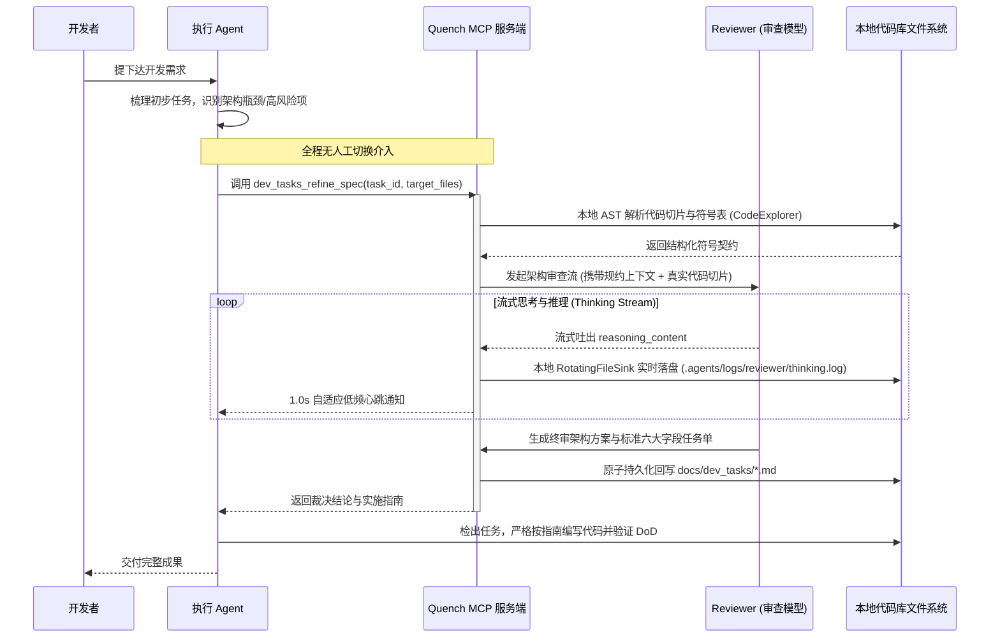

# Stage 4: 基于独立 API 的全自动 Subagent 委派与代码库动态探查架构规划 (已交付归档)
(Archived Stage 4: Automated Subagent Delegation & Dynamic Codebase Inspection Roadmap)

> **归档状态**: ✔️ 已完全交付并验证 (Delivered in v0.2.0, 2026-09-21)  
> **实施任务单**: `docs/dev_tasks/archive/2026-09-21_model_switching_optimization.md`  
> **交付物**:
> - `ReviewerClient` 多厂商解耦架构 (`plugins/quench-dev-tasks/server/reviewer_engine.py`)，支持 DeepSeek (思维链 + Prompt Cache 计费感知)、OpenAI、Ollama 本地全离线、宿主 Subagent 及 Manual 优雅回退；
> - `CodeExplorer` AST 符号解析器与 `dev_tasks_refine_spec` 智能规约生成闭环 (`plugins/quench-dev-tasks/server/code_explorer.py`)；
> - `RotatingFileSink` 实时思考流脱敏落盘与 1.0s 低频进度心跳 (`plugins/quench-dev-tasks/server/reviewer_engine.py`)；
> - `Draft` 任务草案态与 `lint_task_physical_feasibility` 物理可行性门禁；
> - 全量 167/167 自动化单测覆盖。

---

## 1. 背景与演进契机 (Context & Motivation)

在 Quench MCP 套件的日常开发实践中，形成了典型的“执行 Agent 快速执行 + Reviewer 深度架构规划”的双模型协作预期。然而，在基于 IDE 客户端图形界面的早期方案中，面临两大痛点：
1. **人肉切换心智负担**：开发者必须在多会话之间频繁往返，打断了连续的“无感编程流”。
2. **单一会话上下文污染**：如果在同一个长会话中途切换高智力模型，由于 IDE 机制会将前面包含代码变更、构建日志的全量历史（可能达 5 万~10 万+ Token）无差别发送，造成极其高昂且不必要的配额浪费。

---

## 2. 核心架构设计：Agent-in-Tool 模式 (已实现为 ReviewerClient)

通过在 MCP 服务端内嵌直连大模型 API，将“唤起架构审查”封装为高内聚的 MCP 工具：`dev_tasks_refine_spec` 与 `dev_tasks_escalate`。

---

## 3. 关键技术突破：代码库深度探查能力的实现 (已实现为 AST CodeExplorer)

针对“Reviewer 不能只依赖执行 Agent 提供的偏颇上下文，而需要自主看代码库”的核心诉求，方案采用 **静态 AST 探查 + 结构化上下文压缩** 机制：

### 3.1 沙箱化只读能力
1. `read_code_slice(path: str, start_line: int, end_line: int)`：精准阅读目标代码文件特定行段。
2. `search_symbols(query: str, path_pattern: str)`：在项目特定目录运行 ripgrep 检索符号引用。
3. `inspect_structure(directory: str, max_depth: int)`：查看相关模块的目录树与导出接口。

### 3.2 自主分析流程（避免全库 Dump 造成 Token 爆炸）
- **动态 Token 控制**：通常仅探查核心文件切片（约 4k~8k Token），既保证了架构分析的绝对客观与精准，又将输入成本控制在极限水平。

### 3.3 严格的角色权限隔离 (Read-Only Guard)
- 在给审查者开放的探查工具集中，**绝对不包含任何修改/写入文件的工具**。
- 审查者只能输出分析结论与 Quench 标准任务规范，确保代码修改权始终牢牢掌握在主控执行器与测试验证环节。

---

## 4. 交付总结 (Delivery Summary)

本规划于 2026-09-21 伴随 Quench v0.2.0 正式交付闭环，相关逻辑全部合入 `main` 分支。
