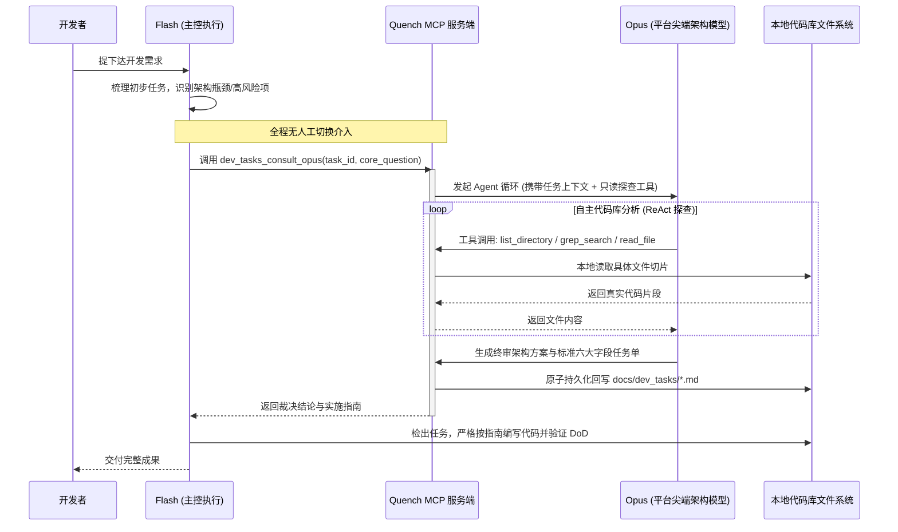

# 基于独立 API 的全自动 Subagent 委派与代码库动态探查架构规划
(Automated Subagent Delegation & Dynamic Codebase Inspection Roadmap)

## 1. 背景与演进契机 (Context & Motivation)

在 Quench MCP 套件的日常开发实践中，形成了典型的“Flash 快速执行 + Opus 深度架构规划”的双模型协作预期。然而，在基于 IDE 客户端图形界面的现有方案中，面临两大痛点：
1. **人肉切换心智负担**：开发者必须在多会话之间频繁往返，打断了连续的“无感编程流”。
2. **单一会话上下文污染**：如果在同一个长会话中途切换为 Opus，由于 IDE 机制会将前面包含代码变更、构建日志的全量历史（可能达 5 万~10 万+ Token）无差别发送给 Opus，造成极其高昂且不必要的 Opus 配额浪费。

> [!NOTE]
> **实施契机**：本规划作为 Quench MCP 的中期演进路线，拟在当前 IDE（如 Antigravity）的预充值/订阅配额充分消耗后正式启动。

---

## 2. 核心架构设计：Agent-in-Tool 模式

通过在 MCP 服务端内嵌直连大模型 API（如 Anthropic 官方 API 或兼容中转服务），将“召唤 Opus”封装为一个高内聚的 MCP 工具：`dev_tasks_consult_opus`。

---

## 3. 关键技术突破：代码库深度探查能力的实现

针对“Opus 不能只依赖 Flash 提供的偏颇上下文，而需要自主看代码库”的核心诉求，方案采用 **轻量 ReAct 循环（Tool-in-Tool）** 机制：

### 3.1 赋予 Opus 的只读探查工具集
当 MCP 将请求转发给 Opus 时，通过 API 向 Opus 注册三项沙箱化只读能力：
1. `read_code_slice(path: str, start_line: int, end_line: int)`：精准阅读目标代码文件特定行段。
2. `search_symbols(query: str, path_pattern: str)`：在项目特定目录运行 ripgrep 检索符号引用。
3. `inspect_structure(directory: str, max_depth: int)`：查看相关模块的目录树与导出接口。

### 3.2 自主分析流程（避免全库 Dump 造成 Token 爆炸）
- Opus **不会盲目全量加载代码库**，而是像真人资深架构师一样，根据任务描述顺藤摸瓜：
  - *例如*：“需要为 MES 工单调度改造响应式状态” -> Opus 主动调用 `read_code_slice("src/store/order.ts")` 查看当前状态流转 -> 发现依赖了设备服务，再调用 `read_code_slice("src/api/device.ts")` 验证签名契约。
- **动态 Token 控制**：通常仅探查 2~4 个核心文件切片（约 4k~8k Token），既保证了架构分析的绝对客观与精准，又将输入成本控制在极限水平。

### 3.3 严格的角色权限隔离 (Read-Only Guard)
- 在给 Opus 开放的探查工具集中，**绝对不包含任何修改/写入文件的工具**。
- Opus 只能输出分析结论与 Quench 标准任务规范，确保代码修改权始终牢牢掌握在主控执行器与测试验证环节。

---

## 4. 成本与体验对比分析

| 维度 | 现状方案 A (IDE 多会话人肉往返) | 现状方案 B (IDE 单会话直接切 Opus) | 未来规划 (MCP 直连 + 自主探查) |
| :--- | :--- | :--- | :--- |
| **操作复杂度** | 较高（需人工开新窗、复制上下文） | 极低（一键切换模型） | **零（完全自动化无感执行）** |
| **Opus Token 消耗** | 极低（约 2k~3k Token） | 极高（全量历史 50k~100k+ Token） | **极低（按需探查约 4k~8k Token）** |
| **代码上下文质量** | 依赖人工或 Flash 摘抄，易漏关键依赖 | 完整但噪音严重，存在历史错误代码干扰 | **极高（Opus 亲自按需读取真实源文件）** |
| **计费渠道** | 消耗 IDE 平台配额/订阅 | 消耗 IDE 平台配额/订阅 | 消耗独立 API 余额 (Anthropic/中转) |

---

## 5. 分阶段落地路线图 (Milestones)

- [ ] **Phase 1: 独立调用核心工具开发**
  - 在 MCP 服务端引入 `anthropic` / OpenAI 兼容协议客户端。
  - 实现基础的 `dev_tasks_consult_opus` 工具，打通单次提示词直传与任务单状态回填。
- [ ] **Phase 2: 只读代码探查运行时 (ReAct Loop)**
  - 实现基于 FastMCP 的内部 Agent 执行循环，注入 `read_code_slice` 与 `search_symbols`。
  - 增加探查预算保护（如单次任务最多只允许探查 5 次、最大 Token 上限控制）。
- [ ] **Phase 3: 协同规则与策略优化**
  - 在主控 Flash 的 Rule 中定义清晰的升级触发矩阵（何种复杂度的冲突自动调用 Opus，何种常规操作自行处理）。
  - 完善本地缓存与上下文去重，避免重复探查同一文件。
